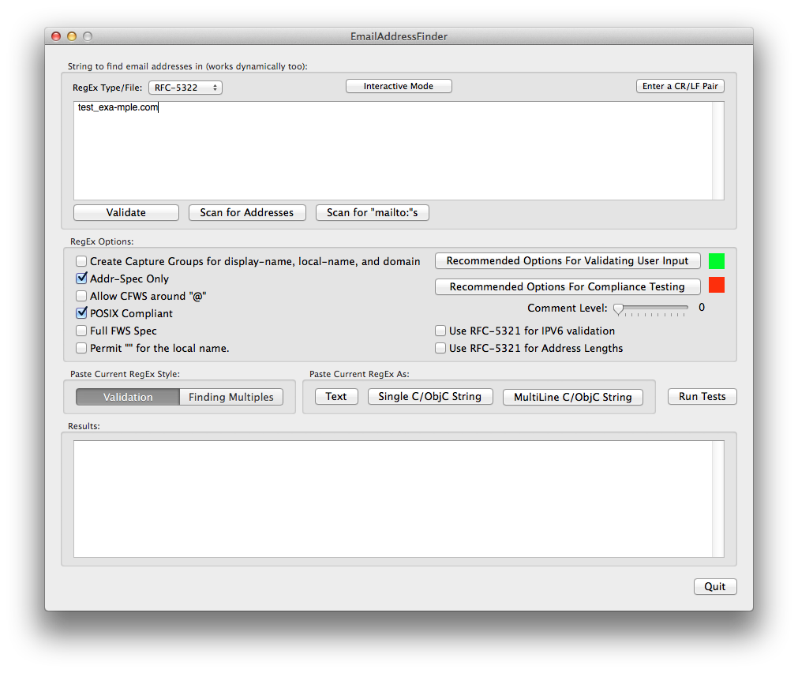

EmailAddressFinder
==================
Copyright (c) 2013 by David Hoerl. All rights reserved.

ABSTRACT

EmailAddressFinder began as a project to utilize existing EMail regular expressions, and has morphed into one that creates near-perfect regular expressions to parse email addresses. The project starts with RFC-5322 (excluding the deprecated formats), and builds complete regular expressions by concatenating pieces using user selectable options. Then, using the resultant regular expression, you can test its capabilities with text entered into a text view, or against a test suite.

INTRO

The OS X app contained in this folder provides the following features:

1. Parsing regular expressions built up from components, all directly implementing the various RFC-5322 sub-components (and other relevant RFCs and Errata), and crafted to your specification (using options). The components exist (for the most part) in text files, and are in a readable form that is turned into parseable form by the program.

2. User settable options to create the precise parser you need for your application. For instance, if you only want to parse text in the form of "local-part@doman", you can specify just that using its RFC-5322 name "Addr-Spec". However, if you want to use the full "MailBox" specification, which allows both that and the "Display-Name <addr-spec>" format, you can select that option.

3. An Objective-C class, that using the parser, can validate a single string, or be used to extract multiple addresses from a text blob.

4. C code using POSIX expressions to validate single email addresses.

"Wait", you say, "I've read that the RFC-5322 spec makes it impossible to create a compliant regular expression!". Technically that is correct. The spec provides for comments, and comments can nest to any depth. That said, how many email addresses have you seen with comments before? Me, none - I never saw one before reading the spec. The solution to supporting nested comments is to design a regular expression that supports nexted comments to a specified depth.

Comments can occur at specific locations, and have the general form of '( 'text' ')'. So the regular expression produced here supports "(text) | (text ( text) text) | (text ( text ( text (text ( text ( text (text) text) text) text) text)". This portion of the regular expression is created in code using a user specified depth. For testing with well known test suites, a depth of 5 was necessary. In the real world, you would most likely set the control to 0 or 1 - it's your choice.

CONSTRUCTION

The directory "RegularExpressionComponents" contains the text files used to build the final regular expression. Their name starts with the relevant RFC followed by the component produced. Each file meets a local formatting specification, which allows the file to be human readable and commentable, but simple to strip to a clean regular expression substring. If the line begins with a '#', it's a comment so skip it. Any string of " #" begins a line comment and is stripped from where it occurs to the end of the line. A single period ends parsing for that file, so subsquent lines can contain related text or comments (and makes it easier to try out various versions of text).

One of the most important goals of this project, if not the most important, was to provide the direct and absolute linkage between each RFC specification and the final resulting regular expression. All to often one sees a StackOverflow post with a huge regular expression that says, this seems to work pretty well. By having the linkage to the spec here, future Errata approvals and future RFC revisions can be easily addressed.

The method "createRegEx:" in TheWindowController.m reads in each of the above subcomponent files, calls another method to remove single line comments and trailing text from the file, then passes them as strings along with the various user selectable options to "RegExBuilder". Note that RegExBuilder must remove trailing comments, and trim white space from each line. This was done to make it easier to debug the subexpressions past to RegExBuilder.

RegExBuilder receives the dictionary of text and options, and constructs the regular expression. The design was intentionally done this way to make it easier to port to languages like Python - it has no other dependencies other than the dictionary. The constructed regular expression can be output to the bottom text view as text (if you plan to put the expression into a text file), one huge C/ObjectiveC string, or a multi-line C/ObjectiveC string (when one huge string just doesn't cut it with your editor).

In addition to just creating and extracting an expression, you can use it to test against text you supply in the top text view, or against a suite of unit tests.

EXPRESSION USAGE

The class EmailSearcher, located in the "FilesYouNeed" directory, takes the regular expression and some text, and performs one or more operations on it. You can test to see if a string is a valid email address, or in addition request the various components as well (display-name, local-part, domain). Also, if you have a blob of text, and you want to extract all valid email addresses contained in it, you can do that too.

The class emplementation also has a C function that performs validation on a single string.

EmailSearcher also contains code to find "mailto" objects (often found in HTML text), and will return each as a dictionary with to, cc, bcc, subject, and body tags.

PROGRAM USAGE

This project contains the project file and all other necessary files to build "EmailAddressFinder", as well as a binary that should run find on Mavericks (for those who don't have Xcode). When the program starts up, you'll find an array of options each of which has a "tooltip" explaining its function. There are two buttons that let you immediately set the required options for a "Compliance" against the included unit tests, and a "Validate" button that sets what I consider a reasonable options for validation.

By setting the "Interactive" button, you can toggle having the app perform validation in real time as you vary the text in the top box; when its off you must tap the "Test" button.

The lower left segmented control varies the expression such that its suitable for just validation (ie prepend the expression with "^" and append a "$") or for extraction of addresses in text blobs.

To run the compliancd suite, launch the app, the "Compliance" button, then tap "Run Test". First, the tests which are suppose to pass are tested, then the tests which are suppose to fail are run. If a test does not return the expected pass/fail value, its logged in the bottom text view. By setting the Compliance button first, then say lowering the number of embedded comments value, you can force errors.

ACKNOWLEDGEMENTS

1. The concept of building up a full regular expression by attacking and solving the piece parts comes solely from Jeff Roberson's "Regular Expression URI Validation", found at http://jmrware.com/articles/2009/uri_regexp/URI_regex.html. I have tried in vain to find a way to thank him for this wonderful piece of true software engineering.

2. A huge thanks to Ian Dunn, whose ratings of different URLs first supplied me with a regular expression to use in an iOS app, and motivated me to do better: http://fightingforalostcause.net/content/misc/2006/compare-email-regex.php

3. Dominic Sayers, who has written several blogs on email validation (http://blog.dominicsayers.com/category/email-address-validation/), and who has created and maintained a PHP validator, along with a huge test suite of addresses also used for testing by this app (https://github.com/dominicsayers/isemail).

INTERNALS

For "mailto: tag searches, uses NSScanner to return an array of dictionaries, each dictionary representing a single mailto item with all tagged values.

For brute force searches, uses regular expressions to return an array of dictionaries, each one containing one to three strings. If the address in the "Mailbox" style, the three strings represent the name, address, and full mailbox specifier. If the string is a simple address, the dictionary only contains the key "address".

An email address is the familiar **fred@mac.com**, and a **mailbox specifier** is of the form **"Fred Smith" <fred@mac.com>**. Also, addresses in the form "mailto:so@so.com" are properly recognized.

RFC5322 defines both email addresses and "mailbox specifiers" in section 3.4. "Address Specification". Mailbox information is returned in a dictionary with three items in each: the "name" (quotes preserved), the "address" (minus angle brackets), and the whole thing as it appeared in the string.

REFERENCES

- Relevant RFCs: http://code.iamcal.com/php/rfc822/
- RFC-3986 - IPV6 syntax
- RFC-3696 Errata ID: 1690 - Total length of email address is 254
- RFC-5322 Errata ID: 3135 - Quoted String redefined (not approved yet, but an option for this is supported)
- RFC-5321 4.3.1 IPv6-address-literal  = "IPv6:" IPv6-addr
- RFC-1035 DOMAIN NAMES (syntax)
- RFC-5321 SMTP - 4.3.1 IPv6-address-literal  = "IPv6:" IPv6-addr
- RFC-5952 A Recommendation for IPv6 Address Text Representation - better understand best practices in possibly reformatting values (Future)
- RFC-3696 "mailto:" specified (section 4.3):  http://tools.ietf.org/html/rfc3696 and errat: http://www.rfc-editor.org/errata_search.php?rfc=3696
- RFC-6068 "mailto: format:  http://tools.ietf.org/html/rfc6068
- Max len of local-part == 64, total is 254 - see http://www.rfc-editor.org/errata_search.php?rfc=3696 Errata ID: 1690 (ditto in RFC-5321 4.5.3.1.3. Path)

- http://blog.dominicsayers.com/category/email-address-validation/ - Priceless Source of Information on Email addresses and validation
- Email Address Evaluation Blog: http://isemail.info/about
- Comparison of various algoritms: http://fightingforalostcause.net/misc/2006/compare-email-regex.php
- What the PHP regex suffix means (e.g., "/searchString/suffix"): http://www.php.net/manual/en/reference.pcre.pattern.modifiers.php

- Regex1 source: http://svn.php.net/viewvc/php/php-src/trunk/ext/filter/logical_filters.c?view=markup and ranked #1
- Regex2 source: http://jgotti.net/ and ranked #2 now (but known problem with Mailbox format, i.e., <a@b.com>, and multiple addresses)

Other Test Cases
- http://hackage.haskell.org/packages/archive/email-validate/0.2.3/doc/html/src/Text-Email-Validate.html
